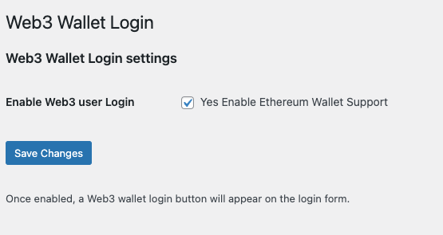
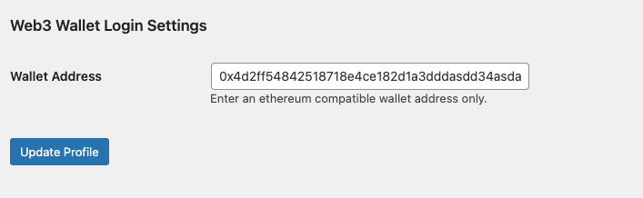
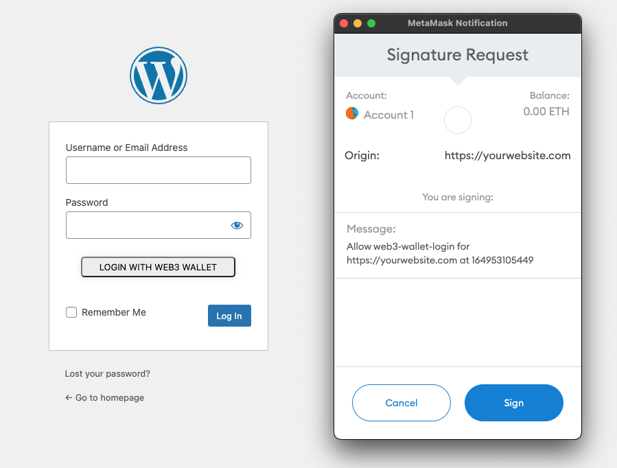

# web3-wallet-login

This module allows for users to login via their web3 wallet.

Administrators can provide the ability to enable Web3 Wallet Login and set public addresses for any wordpress user account.

Once enabled, a user will see a button on the login page that will launch their web3 ethereum compatible wallet (ie metamask) and allow them to sign a message.  Signing a message ensures the user is the owner of the address they are logging in with and does not compromise any account information or cost any gas fees.





Features:
```
- Web3 wallet login
- Require message signature for verification
- Ethereum network support
```
Settings page:
`/wp-admin/options-general.php?page=web3-wallet-login`


